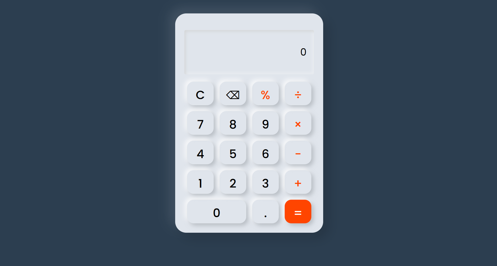

# 🧮 Task 2 – Calculator App | CODSOFT Internship

This is a fully functional and responsive **calculator application** built as part of **Task 2** during my web development internship at **CODSOFT**.
The calculator performs standard arithmetic operations including addition, subtraction, multiplication, and division. It features a clear button, backspace/delete, and handles invalid input gracefully. The design is clean, intuitive, and mobile responsive.

## 💡 Features

- ✅ Basic arithmetic operations
- ✅ Clear and Delete buttons
- ✅ Keyboard input support (optional)
- ✅ Responsive layout for all screen sizes
- ✅ Smooth and simple UI/UX

## 🛠️ Technologies Used
- HTML5  
- CSS3  
- JavaScript (Vanilla)

## 📸 Preview

## 🔗 Live Demo
[🌐 View Live Website](https://sakshi123509.github.io/-CODESOFT_TASK_2/)

📬 Submission
This project is submitted as part of my internship tasks under #CODSOFT.
Feel free to explore and suggest improvements!

🔖 Tags

#codsoft #internship #webdevelopment #frontend #gsap #htmlcss #javascript
© 2025 | Created with ❤️ by Sakshi
